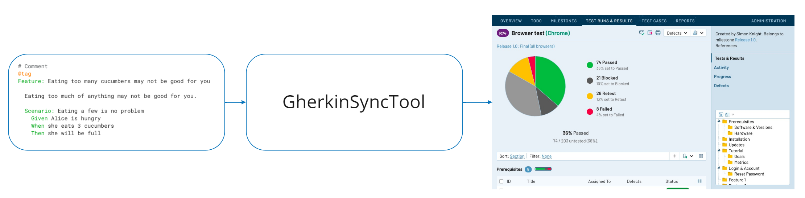
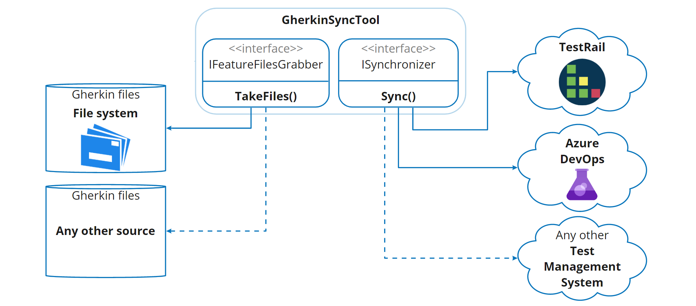

# Quantori GherkinSyncTool

Copyright (c) 2022 Quantori.

Quantori GherkinSyncTool is an open-source console application that synchronizes tests scenarios
in [Gherkin syntax](https://cucumber.io/docs/gherkin/) (also known as feature files) with a test management system.

The GherkinSyncTool helps in building the development process using the BDD or “Specification by examples”. Both
of them implement the basic principles of Agile and focus on team collaboration to improve communication between
analysts, developers, testers, and the customer.



## How it works

The GherkinSyncTool scans the files in the specified folder for the * .feature files. It sends API calls to a test
management system to create or update test cases. Received test ID will be populated into the feature files as tags for
the following synchronization. The test case id tag looks like this: `@tc:1234`. Important: the test case id tag should
not be deleted from the file!

## Supported test management systems

- TestRail
- Azure DevOps
- Allure TestOps
- ... To add a new system implement the ISynchronizer interface.

## Installation

GherkinSyncTool has the next ways how to run:

- Binary executable files for Linux, Windows, macOS are attached to the GitHub releases.

- Nuget .NET tool https://www.nuget.org/packages/GherkinSyncTool/

    ```
    dotnet tool install --global GherkinSyncTool
    ```

- Installation from the source code

    - Install [.NET](https://dotnet.microsoft.com/download).
    - Clone the repository and open the terminal there.
    - Build solution

      ```
      dotnet build
      ```

    - Run app

      ```
      dotnet .\.\GherkinSyncTool\bin\Debug\net5.0\GherkinSyncTool.dll
      ```

### TestRail

TestRail's API should be enabled. In order for the tool to work correctly, the TestRail test template should have the
custom fields that are presented in the table below. The template should not contain any required fields. An existing
template can be used or a new one created.

| System Name          | Type     |
|----------------------|----------|
| `preconds`           | Text     |
| `steps_separated`    | Step     |
| `tags`               | String   |
| `gherkinsynctool_id` | String   |
| `automation_type`    | Dropdown |

## Configuration

GherkinSyncTool can be configured in three ways. The priority corresponds to the list order.

1. appsettings.json. [Example](GherkinSyncTool/appsettings.json).
2. Environment variables.
3. Command-line arguments.

### Common settings

| Parameter     | Description                                                                                          | Required |
| ------------- | ---------------------------------------------------------------------------------------------------- | :------: |
| BaseDirectory | Absolute or relative to application folder path that contains *.feature files                        | Yes      |
| TagIdPrefix   | A tag prefix that will be used for mark test scenarios as synchronized with a test management system | No       |

Allure TestOps note: `TagIdPrefix` should be configured to fill the 'as_id' Allure label correctly. For example, for
Specflow TagIdPrefix should be equals `@label:as_id:` It is required to not duplicate manual and automated test cases.
The test run result will be attached to the correct Allure test ID.

### Formatting settings

| Parameter      | Description            | Required |
| -------------- | ---------------------- | :------: |
| TagIndentation | Left indent for tag ID | No       |

### TestRail settings

| Parameter                  | Description                                                                                      | Required |
| -------------------------- | ------------------------------------------------------------------------------------------------ | :------: |
| ProjectId                  | ID of a project that will be used for synchronization                                            | Yes      |
| SuiteId                    | ID of a suite that will be used as a parent for creating sections                                | Yes      |
| TemplateId                 | ID of a template that will be used for creating or updating test cases                           | Yes      |
| RetriesCount               | Count of retries in case a TestRail server returns an unsuccessful status code                   | No       |
| PauseBetweenRetriesSeconds | Pause between retries (in seconds) in case a TestRail server returns an unsuccessful status code | No       |
| BaseUrl                    | TestRail URL address                                                                             | Yes      |
| UserName                   | TestRail user name                                                                               | Yes      |
| Password                   | TestRail password                                                                                | Yes      |
| ArchiveSection             | Deleted folders will be moved to this section                                                    | No       |
| GherkinSyncToolId          | ID for isolating usage of multiple GherkinSyncTools in one test management system                | Yes      |

#### TestRail Tags

- `@Reference:JIRA-123` tag from a feature file will be parsed and filled as 'JIRA-123' to the reference testrail test
  case field.
- `@Priority:High` tag from a feature file will be parsed and filled as 'High' to the priority testrail test case field.
- `@Automated:UI` tag from a feature file will be parsed and filled as 'UI' to the automation type testrail test case
  field.

### Azure DevOps settings

| Parameter               | Description                                                                       | Required |
|-------------------------|-----------------------------------------------------------------------------------| :------: |
| BaseUrl                 | Azure DevOps URL address                                                          | Yes      |
| PersonalAccessToken     | Personal access token (PAT)                                                       | Yes      |
| Project                 | Name of a project                                                                 | Yes      |
| Area                    | Work item area path                                                               | No       |
| GherkinSyncToolId       | ID for isolating usage of multiple GherkinSyncTools in one test management system | Yes      |
| SetThenStepsAsExpected  | Set "Then step" as Azure DevOps expected result                                   | No       |

### Allure TestOps settings

| Parameter                | Description                                                                       | Required  |
|--------------------------|-----------------------------------------------------------------------------------|:---------:|
| BaseUrl                  | Azure DevOps URL address                                                          |    Yes    |
| AccessToken              | API access token                                                                  |    Yes    |
| ProjectId                | ID of a project that will be used for synchronization                             |    Yes    |
| GherkinSyncToolId        | ID for isolating usage of multiple GherkinSyncTools in one test management system |    Yes    |
| CustomFields             | Set custom fields                                                                 |    No     |
| TestLayer                | Set a scenario test layer                                                         |    No     |
| BackgroundToPrecondition | Put background steps to precondition                                             |    No     |

#### Allure Tags

- `@Status:Draft` a test case status will be changed to "Draft".
- `@Automated` a test case will be marked as automated.
- `@Component:Frontend` the "Component" field will be set as "Frontend".
- `@Layer:UI` set a scenario test layer.
- `@GST:Web` is a unique identifier that will be populated automatically. Don't remove it.

- Example:

```
@Automated
@Status:Draft
@Component:Auth
@tc:235
Scenario: Test case example
  Given prepare sustem
```

## Architecture



## History

The project selected a test strategy with a single place for storing autotests and manual tests. The test strategy
should reduce the gap between manual and automation tests and make support easier. To achieve this, Gherkin syntax was
chosen. The process of describing test scenarios in such a way is a behavior-driven development (BDD). The project uses
the TestRail test management system. The GherkinSyncTool allows having both manual and automated test scenarios in
TestRail so that it is possible to create test runs and have an understanding of what is automated and what should be
executed manually.

## Contribution

Pull requests are welcome. For major changes, please open an issue first to discuss what you would like to change.
Please make sure to update tests as appropriate.

## License

Quantori GherkinSyncTool is released under [Apache License, Version 2.0](LICENSE)
